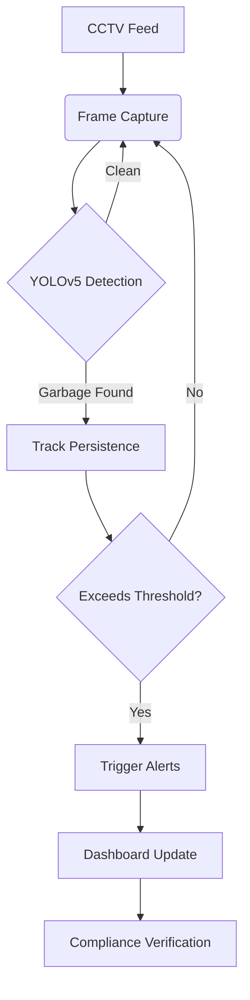

# 🚮 CleanVision ✨  
**Automated Garbage Detection and Alert System for Post Offices using YOLOv5**

CleanVision is a computer vision-based system developed during the **Smart India Hackathon (SIH)** to automate cleanliness monitoring across **post office premises**. It uses a custom-trained **YOLOv5** model to detect garbage in surveillance footage, trigger real-time alerts, and display actionable insights via an interactive dashboard.

The project aims to ensure **hygiene, transparency**, and **accountability** within postal divisions.

🔗 **GitHub Repo**: [https://github.com/dopTrashTrackers/website.git](https://github.com/dopTrashTrackers/website.git)

---

## 🧠 Key Features

- ⚙️ Garbage Detection using YOLOv5  
- 🕵️ Tracks Garbage Across Frames  
- 📩 Real-time Alerts via SMS & Email (Twilio)  
- 📊 Dashboard to Monitor Cleanliness and Compliance  
- 🏆 Ranks Post Offices Based on Performance  
- 👥 Community Awareness and Engagement Section  

---

## 🛠️ Project Workflow


### 1. Image Acquisition
- Surveillance footage is captured from static CCTV cameras installed at **post office premises**.
- The video stream is processed into frames using **OpenCV**, resized, and prepared as input for the YOLOv5 model.

### 2. Object Detection using YOLOv5
- The **YOLOv5** model processes each image frame to detect garbage items like bottle caps, paper boxes, cigarette butts, and plastic.
- Each frame is divided into grid cells where **bounding box coordinates**, **confidence scores**, and **object classes** are predicted.
- **Non-Maximum Suppression (NMS)** removes overlapping boxes, retaining only the highest-confidence detections.

### 3. First-Time Setup & Running the AI Model
- On **first-time sign-up**, users must **download a Python script** named `Launch AI Model.py` from the dashboard.
- When executed, the script:
  - Captures or accepts an image input
  - Runs the YOLOv5 model locally
  - Returns detection results

> 🛡️ This design ensures model execution is performed locally, **avoiding real-time hosting**, enhancing **privacy** and reducing infrastructure costs.

### 4. Garbage Tracking & Alert System
- Garbage is tracked across frames using **bounding boxes** and size measurement.
- If garbage persists and exceeds a predefined threshold:
  - An **automated alert** is triggered.
  - **Twilio SMS and Email** are sent to divisional officers and cleaning staff.
  - Includes a **proof-submission link** for uploading a cleaned image post-action.
  - Dashboard updates in real-time with compliance status.

### 5. Interactive Dashboard

Built using **React.js**, the dashboard offers a dynamic, real-time view of activity.

#### 📈 Visual Analytics (Powered by Recharts)
- **Bar Chart** – Frequency of different garbage types.
- **Line Chart** – Trends of garbage detection over time.
- **Pie Chart** – Compliance scores per post office.
- **Tabular View** – Timestamped list of detection events.

#### 🏢 Best vs Worst Performing Post Offices
- An **interactive map** highlights **top and bottom performers** based on compliance scores.

#### 🌍 Community Initiatives
- Showcases **cleanliness drives**, awareness programs, and encourages community involvement.

#### 📊 Real-time Ranking System
- Ranks each post office based on:
  - ⏱️ Response time to alerts
  - 🧹 Participation in community programs
  - 🔄 Frequency of garbage detections

---

## 📦 Tech Stack

| Layer               | Tools                                     |
|---------------------|-------------------------------------------|
| **Frontend**         | React.js, HTML, CSS, Recharts            |
| **Backend**          | Flask, Firebase (Authentication & Storage) |
| **Notifications**    | Twilio API (SMS & Email)                 |
| **Mapping & Charts** | React Leaflet (Map), Recharts            |


---

## 🚀 Getting Started

### 1. Clone the Repository
```bash
git clone https://github.com/dopTrashTrackers/website.git
cd website
```
## 🚀 Getting Started

### 2. Install Frontend Dependencies

Make sure you have **Node.js** and **npm** installed. Then, install all frontend packages and start the development server:

```bash
npm install      # Installs all frontend dependencies
npm run dev      # Starts the React development server (Vite)
```
### 3. First-Time User: Run the AI Model Locally

CleanVision uses a **YOLOv5 model** to detect garbage from captured images. For privacy and efficiency, the model runs locally on your machine.

#### 🔽 Step A: Download the Inference Script

Download the Python script named: Launch AI Model

#### 🧪 Step B: Install Python & Model Dependencies

Make sure you have the following installed on your system:

- Python 3.7+
- YOLOv5 repository and its dependencies
- OpenCV
- PyTorch
- Other dependencies: `numpy`, `Pillow`, `matplotlib`

You can install everything using:

```bash
pip install -r requirements.txt
```
If requirements.txt is not available, install dependencies manually:
```
pip install torch torchvision torchaudio
pip install opencv-python numpy matplotlib pillow
```
Step C: Run the Script
Execute the downloaded Python script in your terminal:
```
python "Launch AI Model.py"
```
## 📬 Contributing

We welcome contributions to improve **CleanVision**! Follow the steps below to get started:

### 🛠️ Step 1: Fork the Repository

Click the **Fork** button at the top-right of this page to create your own copy of the repository.

### 🌱 Step 2: Create a New Branch

```bash
git checkout -b feature/your-feature-name
```
### ✍️Step 3: Make Your Changes & Commit
Edit the codebase as needed and commit your changes:
```
git commit -m "Added new feature"

```
🚀 Step 4: Push to Your Fork
```
git push origin feature/your-feature-name
```
📥 Step 5: Create a Pull Request

Open a Pull Request from your forked repository back to the main branch of the original project.

### 🏁 Acknowledgments
🏆 Finalist – Smart India Hackathon 2024

🧹 Inspired by the Swachh Bharat Mission

### 👨‍💻 Team Members

| 🌐 Web & Dashboard Development | 🤖 AI/ML Model Development     |
|-------------------------------|-------------------------------|
| Souvik Maity                  | Nidhi Satyapriya              |
| Abhijeet Awasthi              | Rahul Kumar                   |
|                               | Shraddha Sahu                 |
|                               | Shiekh Mahammad Arzu          |
